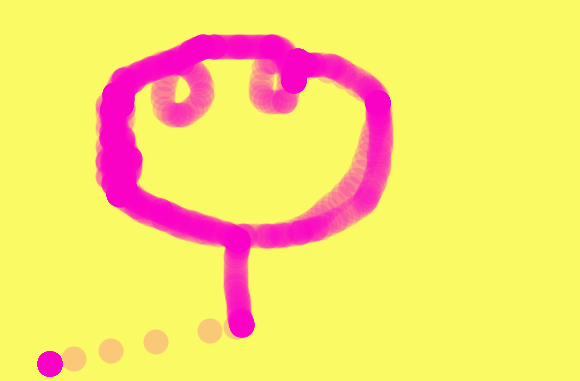

# Write your own painting function.
  With the help of mouseX and mouseY variables, you can easily create a ellipse at your pointers x and y coordinate. Besides, mouseClicked function gives you an access to clean up background by one single click.

